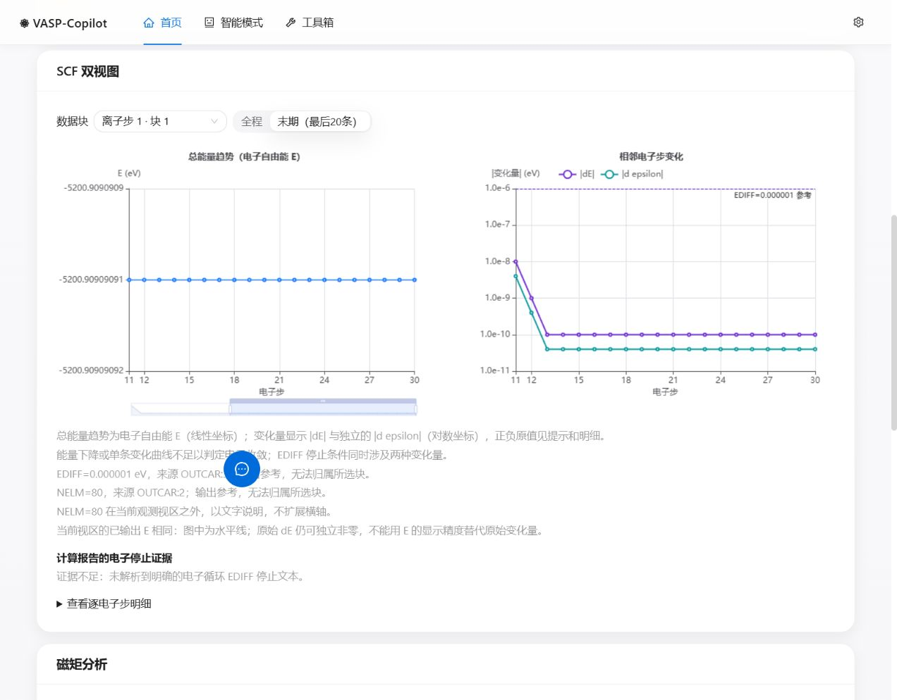
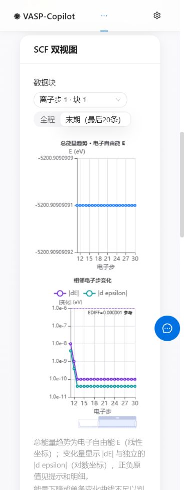

# U-4 SCF 双视图验收

日期：2026-10-02。基线：`141d4e98882889325a45b4a29259a53b5bc6485f`（PR32 已集成）。本文件记录候选实现的本地验证；平台检查和合并状态以 PR 为准，不表示新版本已经发布。

## 实际改变

同一电子块的总能量趋势和相邻电子步变化分别使用线性、对数坐标，宽屏并列、窄屏上下。默认查看最后20条，支持全程及共同缩放。重启后重复离子号分块选择；明细和提示保留符号、原始文本、文件行号及派生来源。阈值、零值、缺失和精度不足按[诊断合同](../../诊断验收合同.md)展示，不新增科学收敛判决。

## 验证结果

- 后端针对 U4、解析器、存储绘图、API、规则和真实样例回归：154 passed。
- 前端 SCF 组件、领域模型、结果页修复兼容和下载面板：28 passed；其中领域模型12项包含真实 ECharts SVG 渲染，验证极小 EDIFF 参考线实际存在。
- 前端 build、lint、`git diff --check` 通过。build 保留既有大 chunk 提示，lint 保留既有 Fast Refresh 警告；jsdom 对伪元素样式的提示不等于浏览器验收。
- 独立复检19个边界场景通过：重启、断档、参数回显上下文、冲突、超大整数、输出精度、原始零值和非有限 dE、EDIFF=0、停止证据。最终未发现未解决的 P1/P2。

可重复的代码验证入口：

```sh
python -m pytest backend/tests/test_u4_scf.py backend/tests/test_parsers.py backend/tests/test_store_plots.py backend/tests/test_api.py backend/tests/test_rules.py backend/tests/test_diagnosis_real_case_regressions.py
cd frontend
npm run test -- src/components/diagnosis/ScfPlot.test.tsx src/components/diagnosis/scfPlotModel.test.ts src/pages/DiagnosisResultPage.repair.test.tsx src/components/diagnosis/RepairSuggestions.test.tsx
npm run build
npm run lint
```

## 真实浏览器中的受控回放

独立本地端口，以合成 INCAR/OSZICAR/OUTCAR 经真实解析器、诊断服务和 HTTP API，打开实际诊断页面；AI 禁用。未用假图表代替 ECharts。检查1280×1000、375×1000；窄屏页面无横向溢出。

1. 30个电子步，初期大变化、末期带符号 dE 降至 1e-10；确认全程、末期、拖动区间的两图横轴联动，纵轴根据当前区间调整。原 E 打印值相同时明确说明，不制造细节。
2. EDIFF=1e-6、NELM=80：实际显示正阈值参考线；横轴截止观测步，不强行扩大到80。提示显示 OSZICAR 第14行 dE=-1e-10、d epsilon=4e-11 和原始 token。
3. 重复离子号的两个块分别选择；零值在对数图不绘制，逐步明细仍保留。截断第三块标推断编号，缺步不连线、不跨步派生，星号溢出明确无效。
4. EDIFF=0 显示固定步数语义，不画正阈值线；仅一个电子点、缺少阈值时显示证据不足，不填默认200或虚假收敛状态。





## 限制

以上是软件测试、合成样例回放及浏览器验收，未执行真实 VASP、LLM、MP、SSH 或 HPC。无法可靠将 OUTCAR 参数和停止文本归属某个 OSZICAR 块时保持参考／未归属状态。既有 MD 汇总归属、确定性规则和磁矩模块本轮不扩展。原用户运行环境未切换，临时验收服务已停止。
