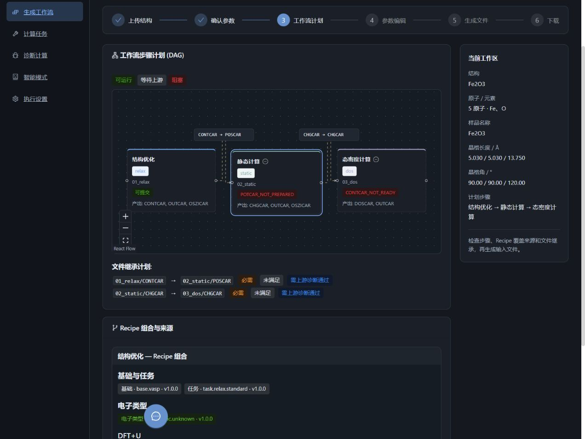
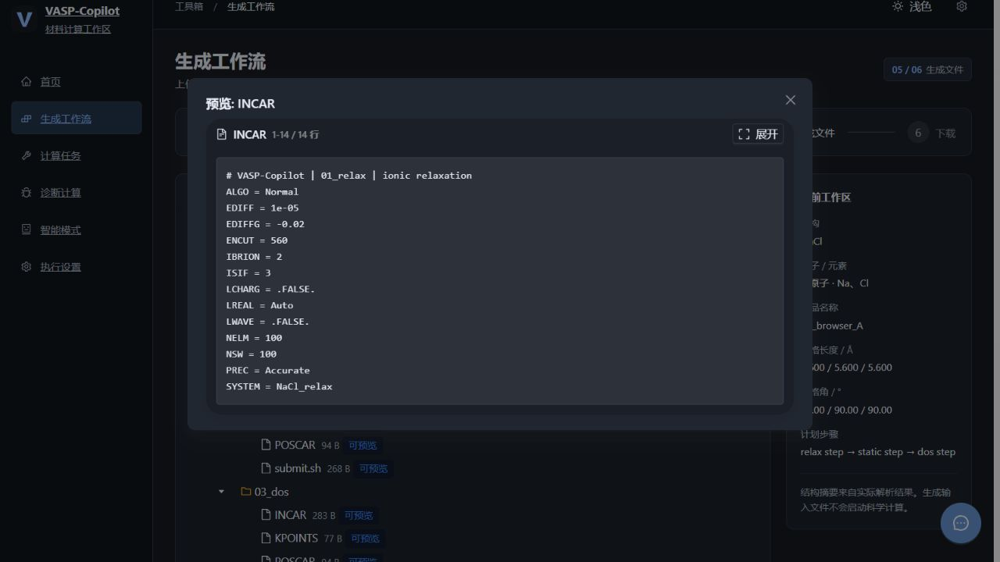

# Workflow Builder 科研工具界面与文件预览隔离

本批基于 `bb95e031bf571113eb8314f0afe0e1705892ab51`，限定工作流代表页及必要共享组件。前端视觉接入与真实文件链已在本地验收，Git 交付后仍需检查对应提交的 CI。未合并或发布，未更新桌面 EXE。

## 用户可见变化

- `/workflow` 使用石墨灰、冷蓝强调色的专业科研工具布局，默认深色，可切换浅色；其他路由继续原布局。
- 保留上传结构、参数确认、计划、编辑、生成、下载六阶段及原有人工确认。结构摘要来自真实解析结果；缺失晶格值显示“—”。
- DAG 的完整文件继承标签放在节点上方独立轨道，随拖动重新排布，适应画布包含标签；节点卡片与点击区域一致。Recipe 分类不改变实际组合和覆盖顺序。
- 窄屏导航和摘要重排，参数表在自身区域横向滚动。文件预览随所在页面主题变化，AI 助手的旧位置和窗口缩小时的位置受视口约束。
- 修复跨工作流预览串线：之前每个工作流重复使用 `file_01` 等编号，后生成的工作流可能覆盖旧预览，但旧 ZIP 不受影响。现在 ID 绑定工作流、完整相对路径及内容哈希；修改内容产生新 ID，相同请求保持稳定，不同工作流与步骤相互隔离。

## 兼容与边界

旧版 generated 文件引用无法可靠恢复归属，读取时明确提示“旧版生成文件预览无法确认归属，请重新生成工作流”。原文件和索引保留；不同内容版本使用原有 TTL 清理策略。普通上传、结构归一化和诊断注册语义不变。生成文件 ID 是响应元数据，ZIP 的科学文件、manifest 和打包算法没有因此改变。

当前结构摘要接口不提供逐原子坐标，本批没有接入晶体模型，不会把固定示例伪装成用户结构。真实晶体查看器属于后续 V2-2。参数科学逻辑、MP 查询、调度执行、依赖锁文件及安装包均不在本批变更范围。

## 验证回执

| 验证层次 | 已执行结果 | 范围限制 |
|---|---|---|
| 视觉相关前端测试 | 9 组、70 项通过 | 使用 MSW / jsdom；不是外部服务验证 |
| 新文件缓存回归 | 1 项通过 | 同一 QueryClient 下 A→B→修改 A→旧 A，无清空缓存 |
| 相关后端回归 | 分组 36 + 40 项通过 | 文件身份、持久化、冲突、旧引用、API、ZIP 确定性 |
| 静态与构建 | TypeScript、Vite build、lint、diff 检查通过 | 保留既有 10 条 Fast Refresh 警告、大 chunk 和 Ant Design 提示 |
| 真实浏览器，离线响应 | 1280×960、375×1000 通过 | 六阶段、确认取消/再确认、主题、窄屏、真实 DAG 拖动与 Fit |
| 真实本地 HTTP，公开小样例 | 原基本链 69 请求 / 404 项断言；修复后专项 27 请求 / 69 项断言通过 | NaCl POSCAR / P1 CIF、错误恢复、预览、ZIP 字节/哈希/CRC/文件树 |
| 真实浏览器，本地后端 | A/B 结构不串线，同页重新生成 ENCUT 520→560 后立即显示新值 | 仅软件验收参数，不代表参数科学适用性 |
| 下载落盘 | 修复前真实浏览器 ZIP 11139 B / 17 成员，与 HTTP/manifest 一致；修复后 HTTP ZIP 校验通过 | 未重复进行修复后的浏览器落盘验收；ID 变更不进入 ZIP |
| 独立审查 | 无阻断项 | 文件身份/调用者/旧记录兼容/缓存/ZIP；审查者未重复运行测试 |

初次混合目录逐文件 pytest 调用出现 18 项 fixture 收集错误；改为 `be_a` 目录筛选与 API 文件分组独立调用后全部通过，未改 fixture 语义。新后端回归已加入 Ubuntu CI 的现有检查清单，前端回归由全量测试发现。CI 结果以 PR 对应提交为准，不以本地回执代替。

本地验证使用隔离 DATA_DIR / VASP_AI_HOME，关闭外部功能，不加载用户配置。未调用真实 MP、LLM、SSH、HPC 或 VASP；不把本地生成成功等同计算完成或科学结果成立。

## 复测入口

从仓库根目录、已安装项目测试依赖的环境中执行后端相关组；设置 DATA_DIR 和 VASP_AI_HOME 为专用临时目录，保持外部功能关闭：

```sh
python -m pytest backend/tests/be_a -k "generated_file_identity or pipeline_contract or bundle_zip" -q
python -m pytest backend/tests/test_generated_preview_api.py backend/tests/test_workflow_api.py backend/tests/test_structure_api.py -q
```

在 frontend 目录按已有锁文件安装依赖，运行：

```sh
npm test
npm run build
npm run lint
```

浏览器复测：上传公开小型 POSCAR，确认并生成 A，打开 POSCAR/INCAR；另一个标签上传不同晶格的 CIF 并生成 B；返回 A，确认名称/晶格未变；修改 A 的 ENCUT 重新生成，确认新预览立即更新。只有修改版内容应变化；相同请求的重复生成应保持文件树和 ZIP 相同。此过程只生成和查看文件，不提交计算。

## 页面证据

工作流计划的深色布局及完整文件继承标签：



真实本地后端重新生成后的 INCAR 预览：



完整原始日志保留在统筹的本地隔离验收目录，未作为必需运行文件加入仓库；上述代码测试和命令可复现。下一步先审阅本 PR 与对应 CI，再约定真实坐标接口、接入已确认标准取向的只读晶体查看器。合并、发布和桌面整合分别验收。
